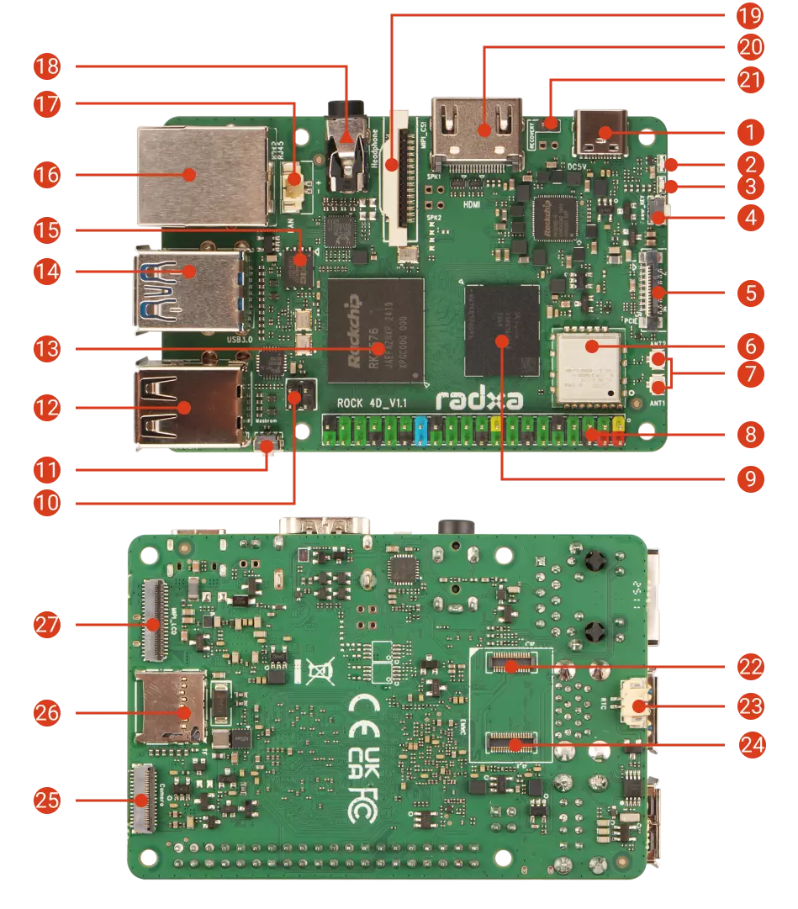
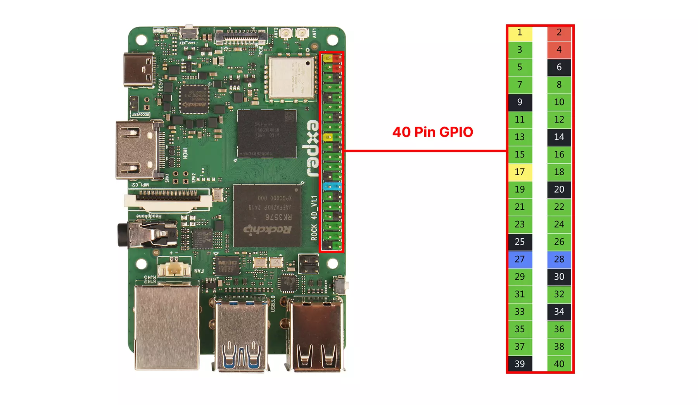

# Nerves System for the Radxa ROCK 4D (Rockchip RK3576)

This branch (`main`) uses the Rockchip vendor kernel and is the
recommended, fully-supported configuration. An experimental
[`mainline`](https://github.com/isaiahdw/nerves_system_rock_4d/tree/mainline)
branch builds a mainline LTS kernel instead; it needs no board patches
but currently lacks the NPU, GPU userspace, and analog audio.

A [Nerves](https://nerves-project.org) system for the
[Radxa ROCK 4D](https://docs.radxa.com/en/rock4/rock4d) single-board
computer. Rockchip RK3576 (4x Cortex-A72 + 4x Cortex-A53, Mali-G52 MC3),
LPDDR5, Gigabit Ethernet, WiFi 6/BT 5.4, HDMI 2.1, USB 3.0, and a 40-pin
GPIO header. The IEx console is on `ttyFIQ0`, the 1.5 Mbaud debug UART on
header pins 8/10/6 (see `rootfs_overlay/etc/erlinit.config`).



In the diagram: 8 is the 40-pin header with the debug UART on pins 8
(TX), 10 (RX), 6 (GND); 11 is the MASKROM button, used together with the
upper USB 3.0 OTG port (14) for `rkdeveloptool`; 26 is the microSD slot
that holds the Nerves firmware; 1 is the USB-C port, which is power only.

## Boot architecture

The board runs Nerves from the SD card, but the bootloader can't live
there: the RK3576 boot ROM only loads its first-stage code from SPI NOR,
UFS, or USB — not from SD. All standard boards ship with U-Boot in the
onboard 16 MB SPI NOR, and that runs first at power-on. From there on,
everything comes off the SD card: U-Boot reads the Nerves environment,
kernel, and root filesystems from it.

A new board boots the Nerves SD as-is, because the factory bootloader
does extlinux boot and the SD always carries a valid
`extlinux/extlinux.conf`. The factory bootloader can't automatically
revert unvalidated firmware, though; that logic is in this system's
U-Boot. Flash it once over USB maskrom (a host-side `rkdeveloptool`
step, see [uboot/README.md](uboot/README.md)). After that, firmware
updates are normal Nerves A/B upgrades on the SD card and the bootloader
doesn't need to be touched again.

## Hardware support

| Feature | Status | Notes |
| --- | --- | --- |
| SD-card boot, A/B firmware slots | Yes | Boots under the factory bootloader out of the box; flash this system's U-Boot to the SPI NOR for automatic revert |
| OTA updates (`mix upload`) | Yes | Delta updates supported (fwup >= 1.12 on device) |
| Ethernet | Yes | Gigabit, gmac0 + RTL8211F |
| WiFi (onboard) | Yes | Quectel FCU760K (AIC8800D80, USB) via the out-of-tree [radxa-pkg/aic8800](https://github.com/radxa-pkg/aic8800) driver in `package/aic8800`. Enumerates as `a69c:8d80`, re-enumerates as `8d81` after firmware upload, loads via modalias. USB WiFi dongles also work |
| Bluetooth | Partial | `hci0` registers (aic_btusb, BlueZ mode); no BT userspace is included |
| HDMI display + console | Yes | Framebuffer console enabled by default; a KMS app takes the display over |
| GPU (Mali G52 MC3) | Yes | Vendor kmod + libmali (EGL/GLES/GBM); `kmscube` is included as a smoke test. No UI toolkit in the system |
| USB input | Yes | eudev + libinput (keyboards/mice/touchscreens) |
| Audio | Yes | ES8388 headphone jack + HDMI audio via ALSA (aplay/amixer included) |
| Watchdog | Yes | dw-wdt armed by Erlang heart (`nerves_heart`), NOWAYOUT |
| RTC | Yes | HYM8563; sets the clock at boot (fit a CR2032 to keep time) |
| USB hosts / gadget | Yes | 2x USB3 + 2x USB2; the OTG port does `usb0` gadget ethernet |
| GPIO/I2C/SPI/PWM/UART/CAN header | Yes | Via [Circuits.*](https://elixir-circuits.github.io/); see the 40-pin summary below |
| SPI NOR access | Yes | `loader` mtd + `flashcp` are included; copy `u-boot-rockchip-spi.bin` over to reflash the bootloader from Linux (maskrom is the documented path) |
| PCIe / NVMe (FPC) | Untested | Enabled in the device tree; needs the M.2 HAT to verify |
| UFS modules | No | Kernel support present; boot/storage integration not done |
| NPU (6 TOPS) | Yes | RKNPU driver (0.9.8) + librknnrt 2.3.2 runtime and headers (`package/librknnrt`); build models on the host with rknn-toolkit2 |
| MIPI DSI / CSI | No | Connectors unused; needs panel/camera bring-up |
| Onboard WiFi in AP mode | Yes | VintageNetWiFi `mode: :ap` |

## Building

Linux (or the Nerves Docker build environment) is required:

```sh
mix deps.get
mix compile
```

The result is a Nerves system artifact consumed by an application project.

### Using in an application

Add the system to your app's `mix.exs` as a `:rock_4d` target (the package
is not on Hex; depend on this repository):

```elixir
@all_targets [:rock_4d]

# in deps():
{:nerves_system_rock_4d,
 github: "isaiahdw/nerves_system_rock_4d", tag: "v0.1.0",
 runtime: false, targets: :rock_4d}
```

Nerves downloads the prebuilt system artifact from this repo's GitHub
release for the tag. To build the system from source instead (requires
the Nerves Docker/Linux build environment, about an hour cold), add
`nerves: [compile: true]` to the dependency.

Then set `MIX_TARGET=rock_4d` for every mix command:

```sh
export MIX_TARGET=rock_4d
mix deps.get
mix firmware
```

## Flashing and upgrades

One-time setup: flash U-Boot to the SPI NOR
([uboot/README.md](uboot/README.md)).

To write the SD card, put it in a USB reader on the host and run:

```sh
mix burn                 # or: fwup -a -d /dev/rdiskN -t complete -i <firmware>.fw
```

(`brew install fwup` on macOS.) Routine SD flashing has no
maskrom/rkdeveloptool step; the card is written directly on the host.

OTA upgrades use the standard Nerves flow (`mix upload`, or `fwup` over
SSH). Upgrades write only the inactive slot. The new firmware boots
unvalidated and U-Boot reverts to the previous slot unless the
application validates it (`Nerves.Runtime.validate_firmware/0`).

## Boot flow

```
RK3576 boot ROM
  └─ SPI NOR: u-boot-rockchip-spi.bin  (TPL/DDR init + SPL @0, U-Boot FIT + BL31 @0x60000)
      └─ bootcmd = run nerves_init nerves_boot   (env @ 15 MB on the SD card)
          └─ Image.<slot> + rk3576-rock-4d.<slot>.dtb from p1 (FAT)
              └─ squashfs rootfs on p2 (A) or p3 (B), root=PARTUUID=<slot GUID>
```

U-Boot reads the Nerves environment block on the SD card (slot selection,
validation flag, firmware metadata) and boots the active slot directly;
unvalidated firmware reverts automatically. If the nerves boot path or the
environment is broken, `bootflow scan` boots `extlinux/extlinux.conf` from
the FAT partition instead. U-Boot build details and provenance:
`uboot/README.md`.

### SD card layout

| Region            | Offset (512 B sectors) | Size    | Contents                          |
| ----------------- | ---------------------- | ------- | --------------------------------- |
| GPT               | 0                      | 32 KB   |                                   |
| (unallocated)     | 64                     | ~15 MB  | Nothing (no bootloader on SD)     |
| Nerves U-Boot env | 30720 (15 MB)          | 128 KB  | Firmware metadata (fw_env.config) |
| p1 `bootfs` (FAT) | 32768 (16 MB)          | 256 MB  | Image.a/b, dtb, extlinux          |
| p2 `rootfs_a`     |                        | 512 MB  | squashfs                          |
| p3 `rootfs_b`     |                        | 512 MB  | squashfs                          |
| p4 `app` (f2fs)   |                        | expands | Application data (`/root`)        |

## Kernel

The kernel source is [armbian/linux-rockchip](https://github.com/armbian/linux-rockchip)
branch `rk-6.1-rkr5.1` (Rockchip BSP 6.1 + upstream-stable merges + Armbian
fixes), pinned by commit SHA in `nerves_defconfig` and fetched by Buildroot
as a GitHub archive. Radxa's ROCK 4D device tree (`rk3576-rock-4d-spi`)
is already in this tree. The only board patch is `linux/0001`, which
fixes two things: it enables the watchdog node (shipped disabled;
`nerves_heart` requires `/dev/watchdog0`) and re-points the `mmc0` alias
at the SD card. The vendor dtsi aliases mmc0 to the disabled eMMC and
the kernel numbers `mmcblk` devices by alias, so without the patch the
SD card is `/dev/mmcblk1` and the env, boot, and app-data mounts fail.

The configuration is the in-tree `rockchip_linux_defconfig` plus two
fragments: `linux/rk3576.config` (Mali Bifrost) and `linux/nerves.config`
(Nerves requirements and board deltas, documented inline). One board
delta worth knowing about: `CONFIG_REALTEK_PHY` for the RTL8211F, which
the vendor defconfig lacks.

Mainline support for the ROCK 4D is improving: the dts landed in 6.15,
ethernet/PCIe/USB/HDMI-audio/UFS were complete around 6.17, and mainline
U-Boot supports the board since v2026.01 (which this system uses). A
future migration to a mainline kernel plus Panfrost would drop most of
the vendor code this system carries.

## Hardware reference

| Peripheral | Device | Notes |
| --- | --- | --- |
| SoC | Rockchip RK3576 (RK3576J on industrial SKUs), 4×Cortex-A72 @ 2.2 GHz + 4×Cortex-A53 @ 2.0 GHz | RK806 PMIC (i2c 0x23) |
| RAM | LPDDR5, 2/4/8/16 GB SKUs | DDR init blob handles LP4/LP5 |
| Boot flash | 16 MB SPI NOR on sfc0 | mtd `loader`; holds U-Boot |
| microSD | sdmmc, UHS-I SDR104 | The Nerves system disk (`/dev/mmcblk0`) |
| eMMC/UFS connector | UFS modules 64 GB–1 TB | eMMC modules unsupported on SPI-NOR (standard) SKUs |
| Ethernet | GbE, gmac0 + Realtek RTL8211F (RGMII) | PoE via the optional PoE+ HAT |
| WiFi/BT | Quectel FCU760K (AIC8800D80, USB a69c:8d80→8d81), WiFi 6 + BT 5.4, external antennas | package/aic8800 driver; wlan0 + hci0 |
| Display | HDMI 2.1 up to 4K@120 (VOP + Samsung HDPTX PHY) | fbcon on by default; app takes over DRM |
| MIPI | DSI 4-lane (up to 2K); CSI 1× 4-lane (or 2× 2-lane) + 1× 2-lane | Not brought up |
| GPU | Mali G52 MC3 | Vendor kmod (`/dev/mali0`) + libmali GBM blob |
| NPU | 6 TOPS INT8 RKNPU | Kernel driver 0.9.8 + librknnrt 2.3.2 |
| Audio | ES8388 codec (3.5 mm 4-pole headphone + mic, drives 32 Ω) + HDMI audio | ALSA; es8323 driver via fallback compatible |
| USB | 1× USB3 OTG/host (upper; maskrom port), 1× USB3 host, 2× USB2 hosts | OTG port doubles as gadget/`usb0` |
| PCIe | Gen2 x1 over 16-pin FPC (RPi 5-style) | M.2 NVMe via Radxa HAT; dts-enabled, untested |
| RTC | Haoyu HYM8563 (i2c 0x51), 2-pin XH battery connector (CR2032) | Sets system clock at boot |
| Fan | 2-pin XH 1.25 mm, 5 V PWM | pwm-fan in dts, thermal-zone driven |
| Debug UART | UART0, header pins 8 (TX) / 10 (RX) / 6 (GND) | 1500000 8N1; `ttyFIQ0` console |
| LEDs | power (default-on), user (heartbeat) | gpio-leds, `/sys/class/leds` |
| Power | 5 V only: USB-C (PD adapters OK, board takes 5 V fixed), header pins 2/4, or PoE+ HAT | ≥3 A recommended |

### 40-pin header



3.3 V logic. Functions muxed onto the header: 4× I2C (I2C5/6/8/9),
6× UART (UART0 debug + UART2/3/4/7/10, several with RTS/CTS), 2× SPI
(SPI1/SPI2), PWM channels from all three controllers, 3× SAI (I2S) +
PDM mic inputs, CAN1, and I3C0. Power: 3V3 on pins 1/17, 5V on 2/4,
grounds on 6/9/14/20/25/30/34/39. Use them from Elixir with
[Circuits.GPIO/I2C/SPI/UART](https://elixir-circuits.github.io/).

---

*Board images: [Radxa Documentation](https://docs.radxa.com/en/rock4/rock4d),
© Radxa Computer (Shenzhen) Co., Ltd., licensed under
[CC BY 4.0](https://creativecommons.org/licenses/by/4.0/).*
